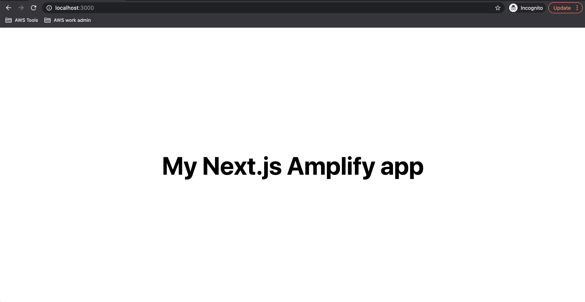
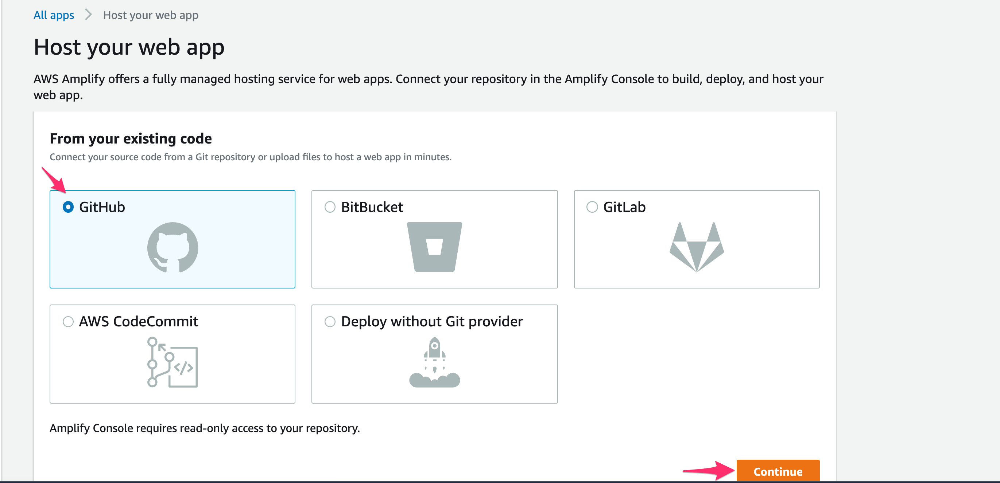

# Deploy a Next.js app to Amplify Hosting

[한국어](README_ko.md)

This guide will show how to deploy an Next.js app to [Amplify Hosting](https://aws.amazon.com/amplify/hosting/).

Sample application will be a server-side rendered application, using Next.js data fetching methods.

> More info on data fetching in Next.js (https://nextjs.org/docs/basic-features/data-fetching#getserversideprops-server-side-rendering)

Once users follow this guide, they will have a web application running on AWS.

## Overview

We will create a new project using Create Next App. We will then set up a git repository that will be hooked up to Amplify hosting for CI/CD.

We will then use Amplify console to set up Amplify hosting and add our git repository to start deployment.

This hands-on lab is expected to be done in less than 20 minutes.

### Required Background / Level

This guide has been made for front-end developers who want to deploy their web applications on AWS.

Having knowledge in React is helpful but not necessary.

### Topics we will cover

- Next.js application
- Web application Hosting
- Deleting the resources

### Development Environment

Before we start, please install

- Node.js v10.x or later
- npm v5.x or later
- git v2.14.1 or later

### AWS Account

If you don't have an AWS account and would like to create and activate an AWS account, please refer to the following
[link](https://aws.amazon.com/premiumsupport/knowledge-center/create-and-activate-aws-account/).

### Create a Next.js application

Let's create a new project using [Create Next App](https://nextjs.org/docs/api-reference/create-next-app)

```sh
$ npx create-next-app amplify-hosting-test-app
```

move into the `amplify-hosting-test-app` directory.

```sh
$ cd amplify-forum
```

### Testing application

First, run the development server:

```bash
npm run dev
# or
yarn dev
```

Open [http://localhost:3000](http://localhost:3000) with your browser to see the result.


You can start editing the page by modifying `pages/index.js`. The page auto-updates as you edit the file.

### / Page (Home)

Let's update **pages/index.js**, which renders / root page.

> More info on [Nextjs Routing](https://nextjs.org/docs/routing/introduction)

```js
/* pages/index.js */
import Head from "next/head";
import styles from "../styles/Home.module.css";
import { useState, useEffect } from "react";

export default function Home({ breeds = [] }) {
  const [breedList, setBreedList] = useState([]);

  useEffect(() => {
    setBreedList(Object.keys(breeds));
  }, []);

  return (
    <div className={styles.container}>
      <Head>
        <title>Amplify Hosting Test</title>
        <link rel="icon" href="/favicon.ico" />
      </Head>

      <main className={styles.main}>
        <h1 className={styles.title}>Amplify Hosting Test App</h1>
        <br />
        <select>
          {breedList.map((breed) => (
            <option key={breed} value={breed}>
              {breed}
            </option>
          ))}
        </select>
      </main>
    </div>
  );
}

export async function getServerSideProps(context) {
  const url = "https://dog.ceo/api/breeds/list/all";
  const res = await fetch(url);
  const data = await res.json();
  const breeds = data.message;

  return {
    props: { breeds },
  };
}
```

See if page loads correctly on a browser at `http://localhost:3000`



### Intializing a git repostory

Let's create a git repository for this project at (https://github.com/new)

Once you create a repository, let's initialize a git in your folder, and
add the created repository url.

```sh
$ git init
$ git remote add origin git@github.com:username/project-name.git
$ git add .
$ git commit -m 'initial commit'
$ git push origin main
```

```sh
$ amplify console
```

### Configuring the Next applicaion with Amplify

Once we have Amplify project ready, we now need to make our Next.js app
to be aware of Amplify project.
We can do this by making the top level component to configure Amplify
with `src/aws-exports.js` file

Let's open **pages/\_app.js** and add the following.

```diff
  import '../styles/globals.css'
+ import Amplify from "aws-amplify";
+ import config from "../src/aws-exports";
+ Amplify.configure(config);

  function MyApp({ Component, pageProps }) {
    return <Component {...pageProps} />
  }

  export default MyApp
```

Once it's done, our Next.app is ready to use AWS managed by Amplify.

### Amplify Hosting 생성

Let's create a new Amplify project in [Amplify console](console.aws.amazon.com/amplify/home)

Select a region.

Click on `New App` -> `Host web app`


### Connect Repository

Let's select the repository service our code is hosted on.



Select branch and repository.

> repository service (e.g. github) will ask you to authorize


### Create a Role

Server-side rendering deployment will require an IAM role.

Click on `Create new role` and go to IAM console.


Create a role, and go back to Amplify console.


click `Next` button


### Deployment

Once deployment starts, we can see the progress.
When deployment is finished, we can see the url where our app is
deployed on.


### Removing app

In Amplify console, click `Actions` -> `Delete App`


