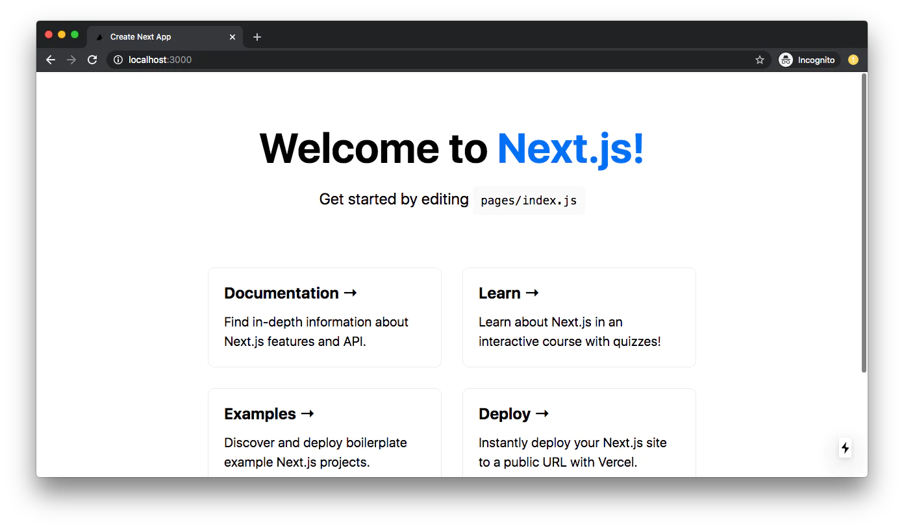

# Deploy a Next.js app to Amplify Hosting

[한국어](README_ko.md)

This guide will show how to deploy an Next.js app to [Amplify Hosting](https://aws.amazon.com/amplify/hosting/).

Sample application will be a server-side rendered application, using Next.js data fetching methods.

> More info on data fetching in Next.js (https://nextjs.org/docs/basic-features/data-fetching#getserversideprops-server-side-rendering)

Once users follow this guide, they will have a web application running on AWS.


## Overview

We will create a new project using Create Next App. We will then set up a git repository that will be hooked up to Amplify hosting for CI/CD.

We will then use Amplify console to set up Amplify hosting and add our git repository to start deployment.

This hands-on lab is expected to be done in less than 20 minutes.

### Required Background / Level

This guide has been made for front-end developers who want to deploy their web applications on AWS.

Having knowledge in React is helpful but not necessary.

### Topics we will cover

- Next.js application
- Web application Hosting
- Deleting the resources

### Development Environment

Before we start, please install

- Node.js v10.x or later
- npm v5.x or later
- git v2.14.1 or later

### AWS Account

If you don't have an AWS account and would like to create and activate an AWS account, please refer to the following
[link](https://aws.amazon.com/premiumsupport/knowledge-center/create-and-activate-aws-account/).

### Create a Next.js application

Let's create a new project using [Create Next App](https://nextjs.org/docs/api-reference/create-next-app)

```sh
$ npx create-next-app amplify-hosting-test-app
```

move into the `amplify-hosting-test-app` directory.

```sh
$ cd amplify-forum
```

### Testing application

First, run the development server:

```bash
npm run dev
# or
yarn dev
```

Open [http://localhost:3000](http://localhost:3000) with your browser to see the result.



You can start editing the page by modifying `pages/index.js`. The page auto-updates as you edit the file.

